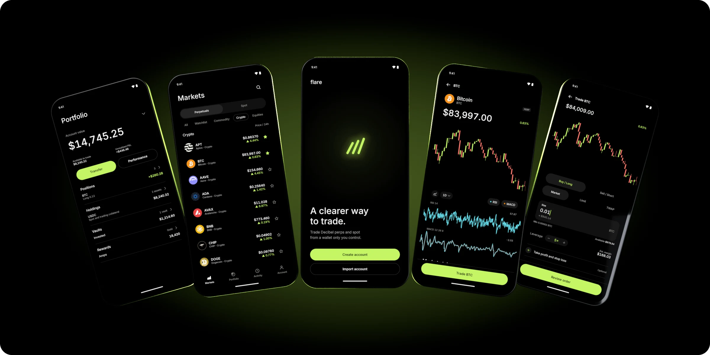

<p align="center">
  
</p>

<h1 align="center">Flare</h1>

<p align="center">
  <b>A clearer way to trade.</b><br>
  An open-source app for trading perps and spot on <a href="https://decibel.trade">Decibel</a>, on Android and iOS.<br>
  Use it just as it comes, or make it entirely your own.
</p>

<p align="center">
  <a href="https://github.com/emeieiron/flare/releases/latest">Download</a>
  &nbsp;·&nbsp;
  <a href="https://flare.mcxross.xyz">Website</a>
  &nbsp;·&nbsp;
  <a href="#build-it-yourself">Build it yourself</a>
</p>

> [!NOTE]
> Flare is under active development and runs reliably on Decibel **testnet**. Try it there and [share feedback](https://github.com/emeieiron/flare/issues). Power users can switch to mainnet at their own risk.

## Contents

- [Made to be yours](#made-to-be-yours)
- [Features](#features)
- [Get Flare](#get-flare)
- [Tech stack](#tech-stack)
- [Architecture](#architecture)
- [Agent skills](#agent-skills)
- [Build it yourself](#build-it-yourself)
- [Security](#security)
- [Contributing & license](#contributing--license)

## Made to be yours

Flare is a complete app with thoughtful defaults, and a personal app waiting to happen. Every line is here to **inspect**, **fork** and **modify** until it fits the way you trade. Its architecture and design system double as a blueprint for Web3 mobile apps on any chain.

## Features

- **Markets**: Crypto, equities and commodities, in perps and spot, with live prices, a watchlist and search.
- **Charts**: Live candles or a clean line, RSI and MACD, and panning through history.
- **Orders**: Market, limit and TWAP, with leverage and attached take profit and stop loss.
- **Portfolio**: Account value, P&L, positions, holdings, DLP vaults, Amps rewards, transfers, deposits and withdrawals.
- **Self-custody**: Create a BIP-39 wallet or import a phrase, an Ed25519 or Secp256k1 key, or an AIP-80 key. Keys stay on the device behind biometrics or passcode. Trades sign with a delegated key that can't withdraw.
- **One-confirmation setup**: Flare opens your trading account and enables trading in a single step. An interrupted setup resumes where it left off.
- **Sponsored fees**: Flare's gas station pays network fees. If it can't, Flare asks before your wallet pays.
- **Offline resilience**: Transactions are simulated before approval, journaled before sending and reconciled on restart.

## Get Flare

**Android:** download `flare-android.apk` from the [latest release](https://github.com/emeieiron/flare/releases/latest). The release notes explain how to verify the checksum, signing certificate and build provenance.

**iOS:** [build it yourself](#build-it-yourself) for now. App Store and Google Play listings will follow.

## Tech stack

| Layer | Technology |
| :--- | :--- |
| **UI** | Compose Multiplatform, Vico charts, MVVM |
| **Platforms** | Android, iOS (SwiftUI shell hosting the shared UI) |
| **Blockchain** | [Kaptos](https://github.com/mcxross/kaptos) (Aptos) |
| **State & DI** | Koin, Coroutines & Flow |
| **Storage** | Room, DataStore, Android Keystore, iOS Keychain |
| **Networking** | Ktor HTTP & WebSockets, Decibel Worker proxy |

## Architecture

```
flare/
├── androidApp/       # Android entry point and packaging
├── iosApp/           # SwiftUI shell for the shared framework
├── shared/           # Screens, ViewModels, repositories, storage
├── decibel/          # Headless Decibel protocol SDK
├── baselineprofile/  # Startup and journey baseline profiles
└── skills/           # Agent skills distilled from Flare
```

Dependencies point downward: platform apps → `:shared` → protocol modules → chain SDKs.

## Agent skills

[`skills/`](skills) teaches coding agents to build Web3 mobile apps the way Flare is built, on any chain:

- **[`flare-architecture`](skills/flare-architecture/SKILL.md)**: structure, MVVM, chain SDKs, transaction safety, signing, onboarding.
- **[`flare-design-system`](skills/flare-design-system/SKILL.md)**: themes, custom components, signing screens, formatting, charts, motion.

## Build it yourself

**Prerequisites:** JDK 21+, Android SDK 37, Xcode 16+ (for iOS), and the companion [`decibel-worker`](https://github.com/emeieiron/decibel-worker).

```sh
# 1. Start the worker proxy
git clone https://github.com/emeieiron/decibel-worker
cd decibel-worker && npm ci && cp .dev.vars.example .dev.vars && npm run dev

# 2. Run Android (debug builds connect to http://10.0.2.2:8787)
./gradlew :androidApp:installDebug
```

For iOS, open `iosApp/iosApp.xcodeproj` in Xcode and run it.

## Security

Keys never leave the device's secure hardware and are excluded from backups. Node and gas credentials stay on a stateless worker proxy, never on devices. To report a vulnerability, see [SECURITY.md](SECURITY.md).

## Contributing & license

Contributions and testnet feedback are welcome. See [CONTRIBUTING.md](CONTRIBUTING.md). Flare is licensed under [Apache 2.0](LICENSE).
