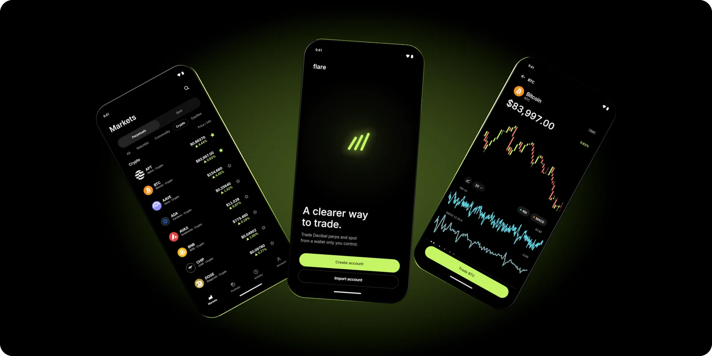
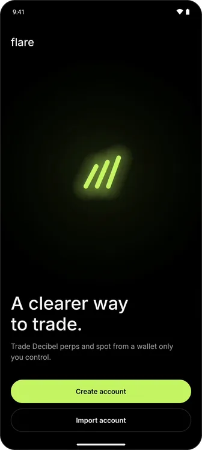
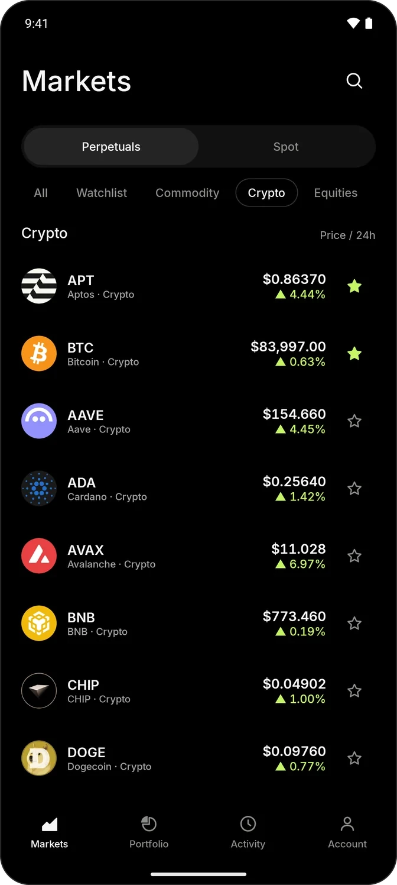
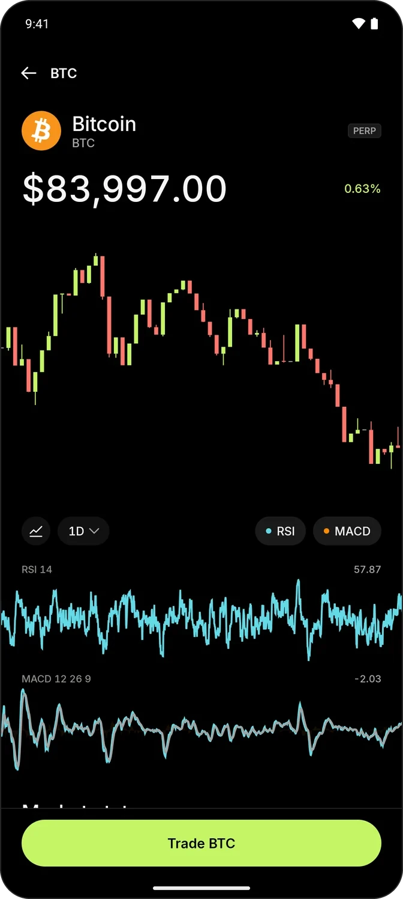
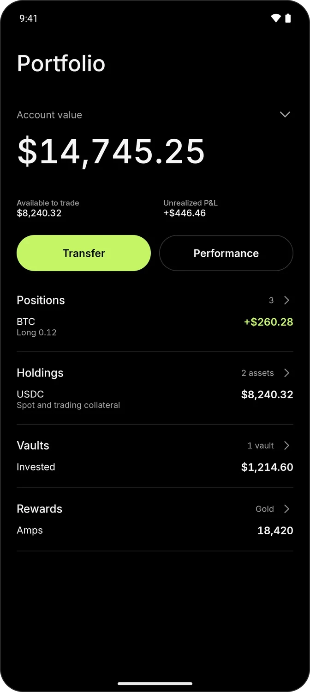
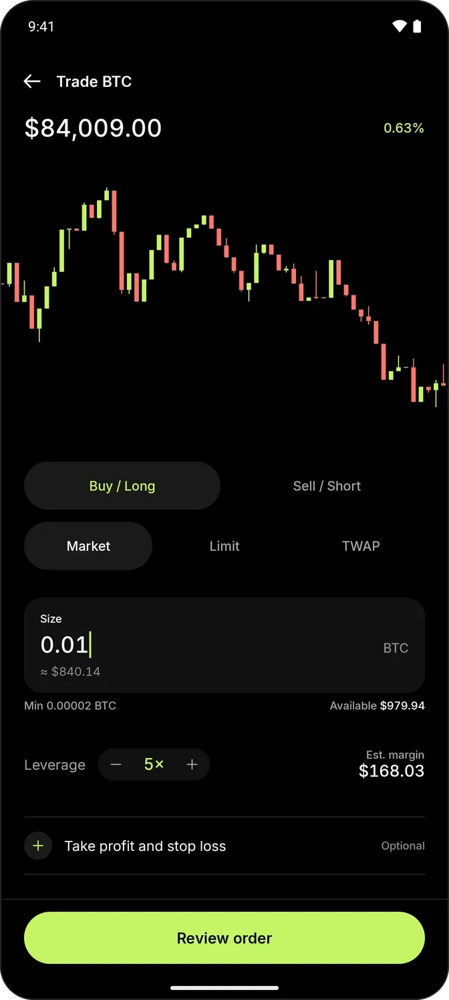
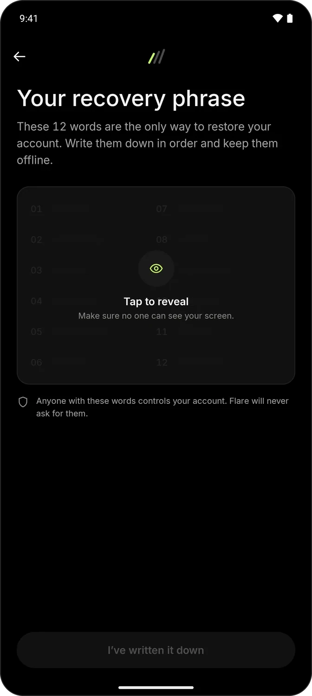
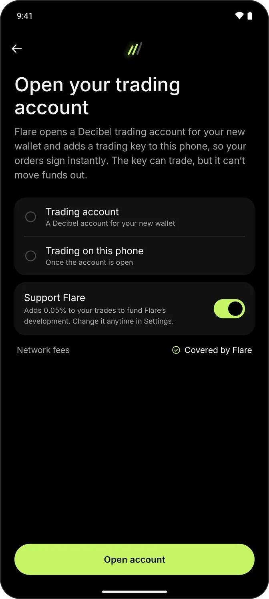
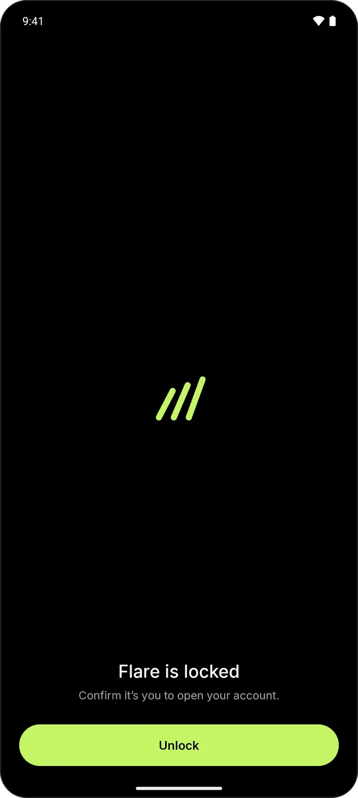

<p align="center">
  
</p>

<h1 align="center">Flare</h1>

<p align="center">
  <b>A clearer way to trade.</b><br>
  An open-source app for trading perps and spot on <a href="https://decibel.trade">Decibel</a>, on Android and iOS.<br>
  Use it just as it comes, or make it entirely your own.
</p>

<p align="center">
  <a href="https://flare.mcxross.xyz">Website</a>
  &nbsp;·&nbsp;
  <a href="#get-flare">Get Flare</a>
  &nbsp;·&nbsp;
  <a href="#build-it-yourself">Build it yourself</a>
</p>

<p align="center">
  
  
  
  
</p>

> [!IMPORTANT]
> Flare is under active development on Decibel testnet. Do not use this repository with mainnet funds.

---

## Made to be yours

Flare is two things at once. For anyone who just wants something that works, it's a complete app with thoughtful defaults: install it, set up a wallet and trade. For anyone who wants more, it's a personal app waiting to happen, with every line here to read and change.

- **Inspect** exactly what the app does with your wallet and your trades.
- **Fork** it and start your own version from the same code.
- **Modify** the screens, the defaults and the details until it fits the way you trade.

---

## Features

- **Markets**: Crypto, equities and commodities, in perps and spot, with live prices, a watchlist and search.
- **Charts**: Candles or a clean line, with RSI and MACD a tap away.
- **Orders**: Market, limit and TWAP orders across perps (`dex_accounts_perp_entry`) and spot (`dex_accounts_spot_entry`), with leverage and attached take profit and stop loss.
- **Portfolio**: Account value and P&L up top; positions, holdings, DLP vaults and Amps rewards underneath; transfers, deposits and withdrawals a tap away.
- **Self-custody**:
  - Create a wallet with a BIP-39 recovery phrase, or import one from a phrase, a raw Ed25519 private key or an AIP-80 key.
  - Keys stay on the device, and Flare opens behind your fingerprint, face or passcode.
  - Trades sign with a delegated trading key that can trade but can't withdraw.
- **Setup with one confirmation**: Back up and confirm your recovery phrase, and Flare opens your trading account and enables trading with a single confirmation. Every step is saved, so an interrupted setup picks up where it left off.
- **Sponsored network fees**: Flare's gas station pays network fees by default, including everything setup needs. If sponsorship is unavailable, Flare says so and asks before your wallet pays. It never switches silently.
- **Offline resilience**: Pending transactions are journaled and reconciled when the app restarts.

<p align="center">
  
  
  
  
</p>

---

## Get Flare

A direct Android download is on its way at [flare.mcxross.xyz](https://flare.mcxross.xyz), with Google Play and the App Store to follow. Until then, [build it yourself](#build-it-yourself).

---

## Tech Stack

Built with **Kotlin Multiplatform** and **Compose Multiplatform**, Flare shares its UI, business and transaction logic across **Android and iOS**, using [**Kaptos**](https://github.com/mcxross/kaptos) as its core Aptos transaction and blockchain engine.

| Layer | Technology |
| :--- | :--- |
| **UI & Presentation** | Compose Multiplatform, Vico Charts, MVI/MVVM |
| **Platforms** | Android, iOS (a SwiftUI shell hosting the shared Compose UI) |
| **Blockchain & Web3** | [Kaptos](https://github.com/mcxross/kaptos) (Kotlin Multiplatform SDK for Aptos) |
| **State & DI** | Koin, Kotlinx Coroutines & Flow |
| **Local Storage** | Room, DataStore, Platform Secure Enclaves (Keychain & EncryptedSharedPreferences) |
| **Networking** | Ktor HTTP/WebSockets, Decibel Worker Proxy |

---

## Architecture

```
flare/
├── androidApp/  # Android entry point, manifests, and packaging
├── iosApp/      # SwiftUI wrapper embedding the shared Kotlin framework
├── shared/      # Shared UI, ViewModels, domain logic, secure storage, and repositories
└── decibel/     # Protocol models, Move ABI serialization, and market types
```

- **`:shared`** houses the app's screens and all core business logic, domain models, and state management.
- **`:decibel`** provides a headless Kotlin Multiplatform client for Decibel protocol types.
- **Kaptos** handles all on-chain interactions: building payloads, gas simulation, transaction signing, submission, and confirmation.

---

## Build it yourself

### Prerequisites

- JDK 21+
- Android Studio Ladybug+ / Android SDK 37
- Xcode 16+ (for iOS)
- Running instance of the companion `decibel-worker`

### 1. Start the Decibel Worker Proxy

```sh
git clone https://github.com/emeieiron/decibel-worker
cd decibel-worker
npm ci && cp .dev.vars.example .dev.vars
npm run dev
```

### 2. Run Android

```sh
./gradlew :androidApp:installDebug
```

*(By default, the debug build connects to the local worker proxy at `http://10.0.2.2:8787`).*

### 3. Run iOS

Open `iosApp/iosApp.xcodeproj` in Xcode and select your target simulator or physical device.

---

## Security

Private keys never leave the device's secure hardware (iOS Keychain and Android EncryptedSharedPreferences). Network communications pass through a stateless, credential-isolating proxy worker to keep sensitive node and gas credentials off client devices.

For threat analysis, see [THREAT_MODEL.md](THREAT_MODEL.md).

---

## Contributing & License

Contributions are welcome! See [CONTRIBUTING.md](CONTRIBUTING.md) for local development workflows and Kaptos snapshot testing.

Flare is licensed under the [Apache License 2.0](LICENSE).
